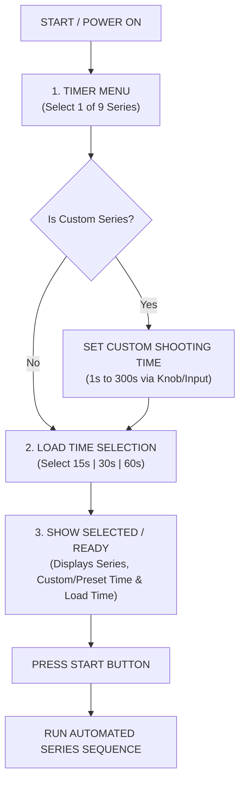
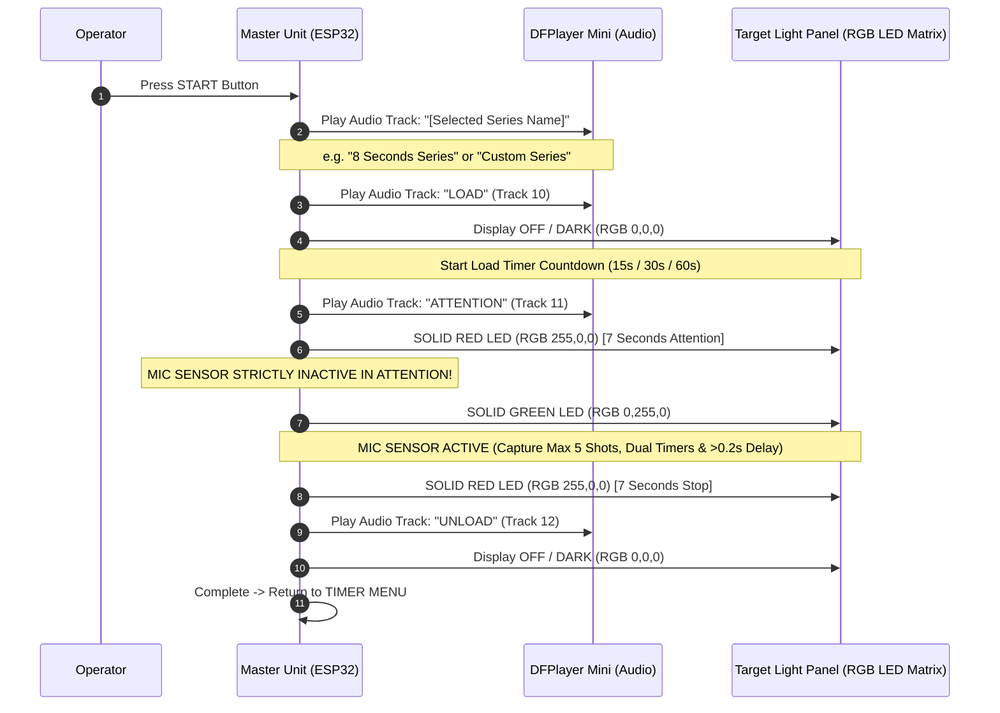

# Range Master Pro Shooting Timer — Main Working Process Specification

**Document Reference**: `QUA/INC/2026/018-R10 (CUSTOM SERIES & SOLID RED ATTENTION/STOP)`  
**Target Hardware**: ESP32-WROOM-32 (Master Control Unit) & ESP32-C3 / WS2812 Matrix (Slave Target Light Panel)  
**Reference Image**: `media_1790336324996.png` (*Main Timer Menu — Series Flowchart*)

---

## 1. System Navigation & Setup Flow

---

## 2. Sequence Lifecycle & Audio Announcement Order

Once **START** is pressed, the automated sequence proceeds through the exact audio and visual phases below:

---

## 3. The 9 Series (8 Official ISSF + 1 Custom Series)

| Column | Series Name | Selected Load Options | Audio Announcement Order | Attention RED | Shooting GREEN | Stop RED | Unload Phase |
| :--- | :--- | :--- | :--- | :--- | :--- | :--- | :--- |
| **1** | **4 Minutes Series** | 15s / 30s / 60s | `"4 Minutes Series"` ➔ `"LOAD"` | **7s SOLID RED** | **240 Seconds** | **7s SOLID RED** | Audio `"UNLOAD"` ➔ Display OFF |
| **2** | **5 × 3 Seconds Series** | 15s / 30s / 60s | `"5 by 3 Seconds Series"` ➔ `"LOAD"` | **7s SOLID RED** | **5 Rounds of 3s** *(7s RED between)* | **7s SOLID RED** | Audio `"UNLOAD"` ➔ Display OFF |
| **3** | **20 Seconds Series** | 15s / 30s / 60s | `"20 Seconds Series"` ➔ `"LOAD"` | **7s SOLID RED** | **20 Seconds** | **7s SOLID RED** | Audio `"UNLOAD"` ➔ Display OFF |
| **4** | **10 Seconds Series** | 15s / 30s / 60s | `"10 Seconds Series"` ➔ `"LOAD"` | **7s SOLID RED** | **10 Seconds** | **7s SOLID RED** | Audio `"UNLOAD"` ➔ Display OFF |
| **5** | **8 Seconds Series** | 15s / 30s / 60s | `"8 Seconds Series"` ➔ `"LOAD"` | **7s SOLID RED** | **8 Seconds** | **7s SOLID RED** | Audio `"UNLOAD"` ➔ Display OFF |
| **6** | **6 Seconds Series** | 15s / 30s / 60s | `"6 Seconds Series"` ➔ `"LOAD"` | **7s SOLID RED** | **6 Seconds** | **7s SOLID RED** | Audio `"UNLOAD"` ➔ Display OFF |
| **7** | **4 Seconds Series** | 15s / 30s / 60s | `"4 Seconds Series"` ➔ `"LOAD"` | **7s SOLID RED** | **4 Seconds** | **7s SOLID RED** | Audio `"UNLOAD"` ➔ Display OFF |
| **8** | **150 Seconds Series** | 15s / 30s / 60s | `"150 Seconds Series"` ➔ `"LOAD"` | **7s SOLID RED** | **150 Seconds** | **7s SOLID RED** | Audio `"UNLOAD"` ➔ Display OFF |
| **9** | **9. Custom Series** | 15s / 30s / 60s | `"Custom Series"` ➔ `"LOAD"` | **7s SOLID RED** | **1s to 300s (User Configured)** | **7s SOLID RED** | Audio `"UNLOAD"` ➔ Display OFF |

---

## 4. Target Light Panel Illumination Process

> [!IMPORTANT]
> Target Light Panel illumination rules:

1. **LOAD Phase (15s / 30s / 60s)**: Target LED Panel is **OFF / DARK** (`RGB: 0, 0, 0`).
2. **ATTENTION Phase (7s)**: Target LED Panel illuminates **SOLID RED** (`RGB: 255, 0, 0`) for **7 seconds**.
3. **SHOOTING Phase**: Target LED Panel illuminates **SOLID GREEN** (`RGB: 0, 255, 0`) for the exact series or custom duration.
4. **STOP Phase (7s)**: Target LED Panel illuminates **SOLID RED** (`RGB: 255, 0, 0`) for **7 seconds**.
5. **UNLOAD Phase**: Target LED Panel returns to **OFF / DARK** (`RGB: 0, 0, 0`).

---

## 5. Acoustic Gunshot Calculation & Dual Timer Rules

1. **5-Shot Maximum Limit**: Exactly **5 shots** maximum are captured per series/round.
2. **Dual Timers Engine**:
   - **Timer 1 (`TOTAL TIME`)**: Measures total elapsed time from the exact start of **GREEN** light ($0.00\text{s}$) to each shot ($T_{\text{total}}$).
   - **Timer 2 (`SPLIT TIME`)**: Measures the split time between consecutive shots ($\Delta T_{\text{split}} = T_{\text{total}, n} - T_{\text{total}, n-1}$).
3. **Late Shot Delay Detection ($> 0.2\text{s}$ after Stop)**:
   - If a shot is fired **more than 0.2 seconds after the RED Stop light turns ON** (i.e. $T_{\text{total}} > \text{GreenDuration} + 0.2\text{s}$), it is flagged as a **`DELAY / LATE SHOT`** (`⚠️ DELAY (+X.XXs OVERTIME)`).
4. **Sensor Inactive During Attention**:
   - During the **ATTENTION** phase (7s RED light before Green), the acoustic mic sensor is **strictly disabled**. Gunshots fired in Attention are **NOT** calculated or recorded.
