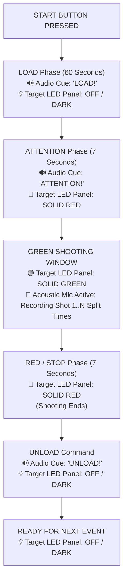

# Shooting Range Control & Light Timer System — Technical Specification & SOW (Rev 7)

**Document Ref:** `QUA/INC/2026/018-R7-FINAL-ISSF-RULES`  
**Client:** Rahul  
**Prepared By:** Inceptarc Technologies Private Limited  
**Date:** September 1, 2026  
**Use Case:** Pistol shooting practice & coaching aid (ISSF 25m Manual Range Training)

---

## 1. Official Sequence Rules & LED Target Display Logic

### 🎯 Corrected 9 Active Pistol Events Matrix

| Event # | Event Name | Load Time | Target LED during Load | Attention (RED) | Green (Shooting) | Red / Stop (RED) | 5s Wait Stage | Target LED during Unload |
| :---: | :--- | :---: | :---: | :---: | :---: | :---: | :---: | :---: |
| **1** | **4 Minutes (Precision)** | 60s | 💡 OFF | 🔴 **7s RED** | 🟢 **240s (4m)** | 🔴 **7s RED** | ❌ **REMOVED** | 💡 OFF |
| **2** | **5 × 3 Seconds** | 60s | 💡 OFF | 🔴 **7s RED** | 🟢 **3s × 5 rounds** | 🔴 **7s RED** | ❌ **REMOVED** | 💡 OFF |
| **3** | **20 Seconds** | 60s | 💡 OFF | 🔴 **7s RED** | 🟢 **20s** | 🔴 **7s RED** | ❌ **REMOVED** | 💡 OFF |
| **4** | **10 Seconds** | 60s | 💡 OFF | 🔴 **7s RED** | 🟢 **10s** | 🔴 **7s RED** | ❌ **REMOVED** | 💡 OFF |
| **5** | **8 Seconds** | 60s | 💡 OFF | 🔴 **7s RED** | 🟢 **8s** | 🔴 **7s RED** | ❌ **REMOVED** | 💡 OFF |
| **6** | **6 Seconds** | 60s | 💡 OFF | 🔴 **7s RED** | 🟢 **6s** | 🔴 **7s RED** | ❌ **REMOVED** | 💡 OFF |
| **7** | **4 Seconds** | 60s | 💡 OFF | 🔴 **7s RED** | 🟢 **4s** | 🔴 **7s RED** | ❌ **REMOVED** | 💡 OFF |
| **8** | **150 Seconds** | 60s | 💡 OFF | 🔴 **7s RED** | 🟢 **150s** | 🔴 **7s RED** | ❌ **REMOVED** | 💡 OFF |
| **9** | **Custom Event** | 10s | 💡 OFF | 🔴 5s RED | 🟢 15s | 🔴 **7s RED** | ❌ **REMOVED** | 💡 OFF |

---

## 🔑 Key Sequence Corrections Applied:
1. **Target LED Panel stays OFF during LOAD & UNLOAD**: No color illumination occurs during 60s Load or Unload.
2. **Attention RED is 7 Seconds**: Attention phase lasts **7 seconds RED** across all events.
3. **Red / Stop lasts 7 Seconds**: After Green shooting ends, Red Stop lasts **7 seconds RED**.
4. **5x3s Inter-round RED is 7 Seconds**: Between round 1 to 5, Red pause is **7 seconds**.
5. **No 5-Second Wait Stage**: Removed completely! Red Stop (7s) goes directly to Unload.
6. **No 3-Second Pre-Start Cue**: Pressing START goes directly to LOAD (60s).
7. **Event 1 updated to 4 Minutes (240s)** with 7s Attention.
8. **Event 8 updated to 60s Load** with 7s Attention.
9. **Event 9 (Finals 50s) DELETED**: Removed from list. Total 9 active events.

---

## 📁 Updated File Links

- 🌐 **[index.html Open Simulator](file:///C:/Users/DELL/.gemini/antigravity/scratch/shooting_range_timer/web_simulator/index.html)**
- ⚡ **[master_control_unit.ino Firmware](file:///C:/Users/DELL/.gemini/antigravity/scratch/shooting_range_timer/master_firmware/master_control_unit.ino)**
- 🎯 **[slave_light_panel.ino Firmware](file:///C:/Users/DELL/.gemini/antigravity/scratch/shooting_range_timer/slave_firmware/slave_light_panel.ino)**
- 🛠️ **[shooting_range_build_guide.md Build Guide](file:///C:/Users/DELL/.gemini/antigravity/brain/de2fd286-f8ac-47ea-a8ea-390586c988ad/shooting_range_build_guide.md)**
